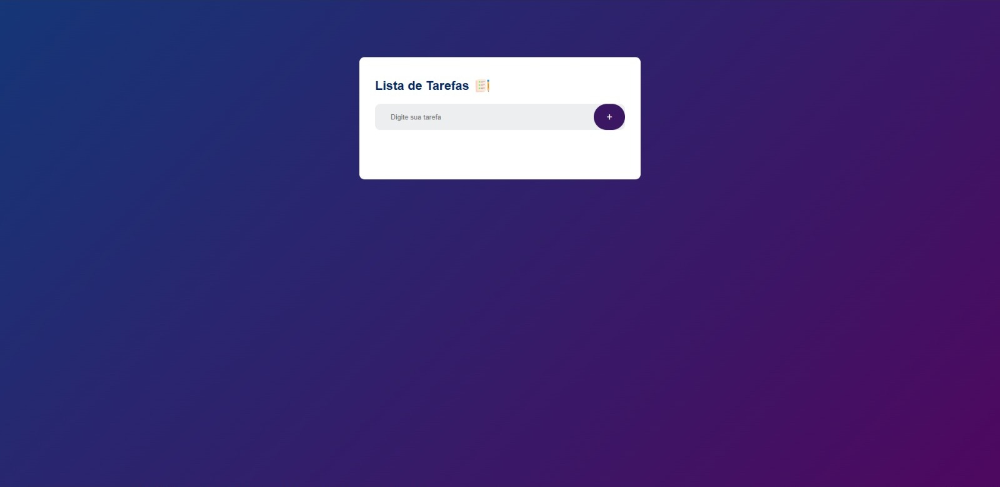

<h1 align="center">Lista de Tarefas :bookmark_tabs:</h1>

  <a href="#nut_and_bolt-funcionalidades">Funcionalidades</a>&nbsp;&nbsp;&nbsp;|&nbsp;&nbsp;&nbsp;
  <a href="#computer-tecnologias">Tecnologias</a>&nbsp;&nbsp;&nbsp;|&nbsp;&nbsp;&nbsp;
  <a href="#pushpin-contribuição">Contribuição</a>&nbsp;&nbsp;&nbsp;|&nbsp;&nbsp;&nbsp;
  <a href="#memo-licença">Licença</a>

  

  

 

## :nut_and_bolt: Funcionalidades

- <strong>Adicionar uma nova tarefa: </strong>Digite o nome da tarefa no campo de texto e pressione Enter para adicionar à lista.

- <strong>Marcar tarefa como concluída: </strong>Clique no ícone de verificado ao lado da tarefa para marcá-la como concluída.

- <strong>Remover uma tarefa: </strong>Clique no ícone de lixeira para excluir uma tarefa da lista.
</ul>

 

## :computer: Tecnologias
Esse projeto foi desenvolvido com as seguintes tecnologias:

 

## :pushpin: Contribuição
Contribuições são bem vindas! Se você encontrar algum problema ou tiver sugestões para melhorar esse projeto, sinta-se à vontade para abrir uma <strong>issue</strong> ou enviar um <strong>pull request</strong>.

 

## :memo: Licença
Este projeto está licenciado sob a Licença MIT.

---

<i>Feito por Gabriel Lucas</i>
